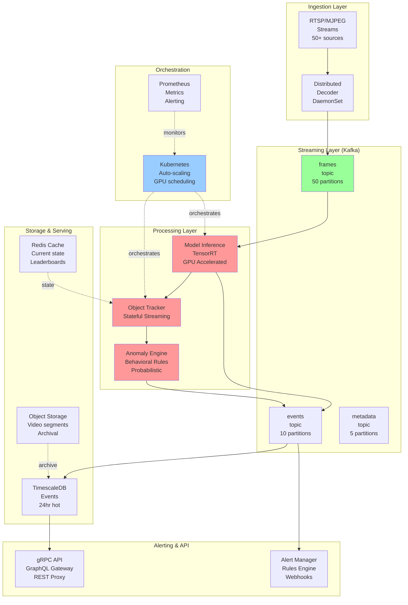
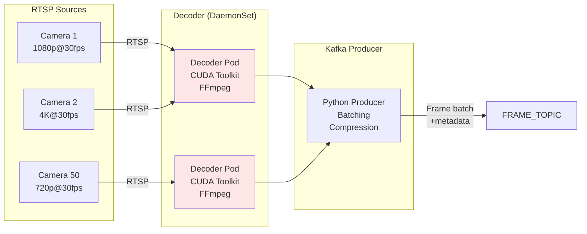
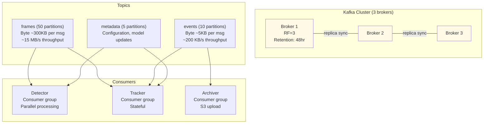
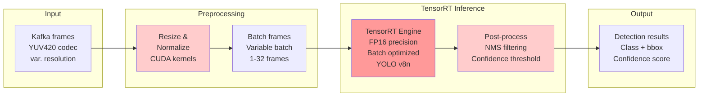
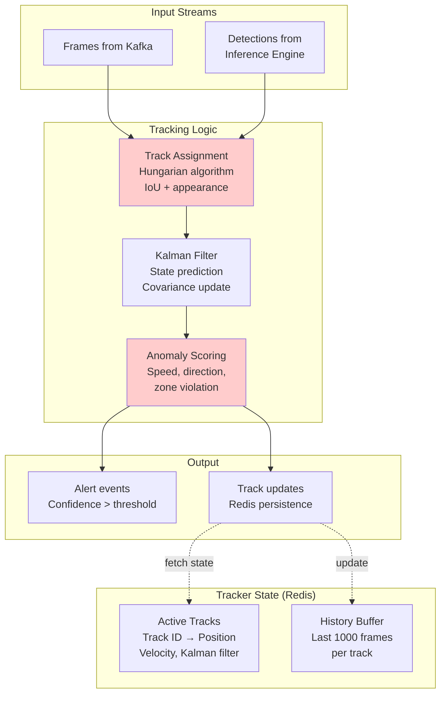
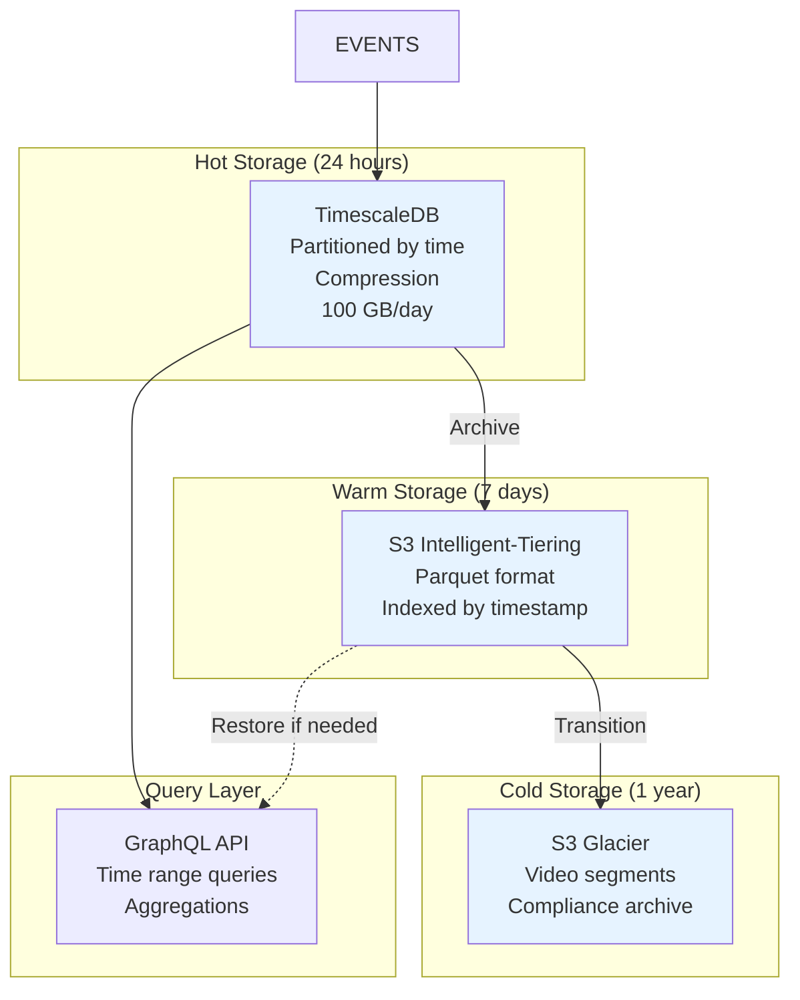
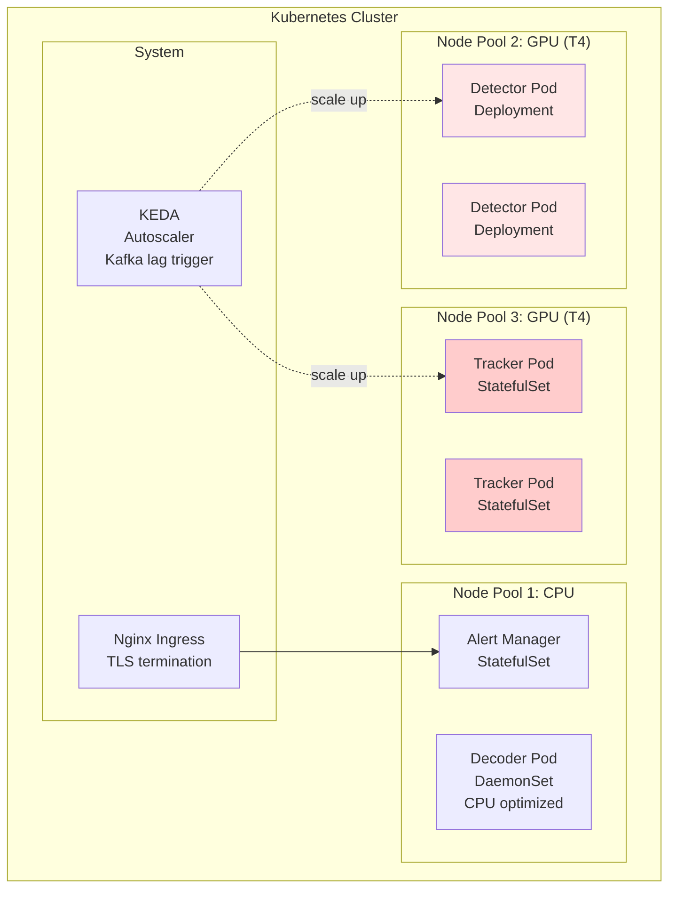
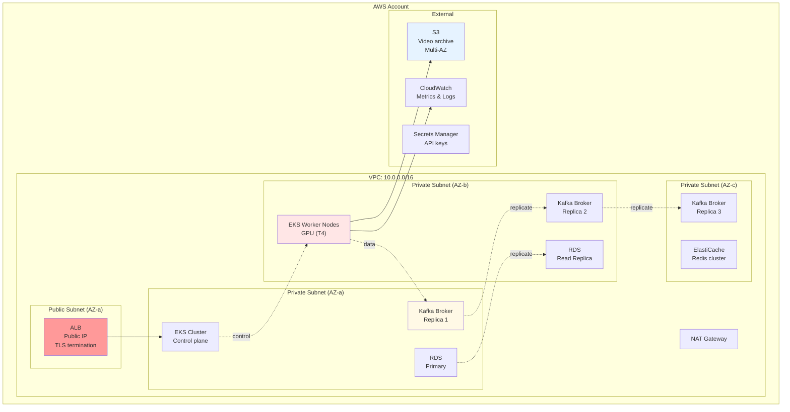
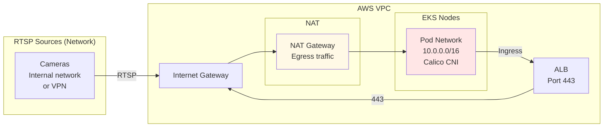

# Distributed Real-Time Object Tracking & Anomaly Detection System
## PHASE 1 & PHASE 2 - Enterprise Architecture Design

---

# PHASE 1: PRODUCT VISION & BUSINESS VALUE

## 1.1 Executive Summary

**System Purpose:** Real-time processing of 50+ concurrent HD video streams with AI-powered object tracking and anomaly detection, deployed on Kubernetes with sub-50ms end-to-end latency.

**Business Value Proposition:**
- **Security Monitoring**: Detect intrusions, crowd anomalies, suspicious behaviors with <50ms alerting
- **Operational Intelligence**: Real-time vehicle/person counting, heat mapping, traffic flow analysis
- **Cost Efficiency**: Process 50+ streams on commodity hardware (vs. specialized surveillance appliances)
- **Scalability**: Horizontal scaling to 200+ streams without architectural changes
- **Fault Resilience**: Zero-loss detection with guaranteed message delivery
- **Enterprise Ready**: RBAC, audit logs, compliance-ready (HIPAA/GDPR patterns)

---

## 1.2 Key Metrics & SLOs

| Metric | Target | Rationale |
|--------|--------|-----------|
| **End-to-End Latency (p99)** | <50ms | Real-time alerting for security threats |
| **Stream Ingestion Rate** | 50+ concurrent HD streams | Market requirement (4K @ 30fps) |
| **Detection Accuracy** | >95% for primary objects | Business KPI for anomaly reduction |
| **System Availability** | 99.9% | Enterprise SLA for security systems |
| **Detection Throughput** | 300+ FPS aggregate | Supports 50 streams @ 30fps + headroom |
| **Cost per Stream** | <$50/month infrastructure | Competitive vs. managed services |

---

## 1.3 Stakeholders & Use Cases

### Primary Users:
1. **Security Operations Center (SOC)**: Real-time threat detection & response
2. **Facility Managers**: Occupancy, parking, loading dock monitoring
3. **Loss Prevention**: Theft/shrinkage detection
4. **Compliance Officers**: Audit trails, recording retention

### Critical Use Cases:
- **Intrusion Detection**: Alert within 50ms of unauthorized access
- **Crowd Anomaly**: Detect unusual gathering, bottlenecks, stampede risks
- **Equipment Monitoring**: Detect unattended objects, wrong-way traffic
- **Behavioral Analytics**: Loitering detection, zone violations
- **Forensic Search**: Query historical detections (24hr+ retention)

---

## 1.4 Competitive Analysis & Market Positioning

| Provider | Strengths | Weaknesses | Our Advantage |
|----------|-----------|-----------|---------------|
| **AWS Lookout** | Managed, easy | High latency (500ms+), limited customization | Custom ML, <50ms |
| **Hikvision** | Mature hardware | Proprietary lock-in, high capex | Open architecture, low opex |
| **Nvidia Metropolis** | GPU optimized | Expensive, vendor-locked | Cost-efficient, multi-vendor |
| **Ours** | Low-cost, real-time, customizable | Requires K8s ops expertise | Enterprise-grade automation |

**Competitive Moat:**
- Proprietary TensorRT optimization pipeline
- Kafka-native architecture (zero-copy processing)
- Intelligent frame batching (variable frame rates)

---

## 1.5 Business Constraints & Drivers

| Constraint | Impact | Decision |
|-----------|--------|----------|
| **Sub-50ms latency** | Defines all data pipeline decisions | Kafka + gRPC, batching strategies |
| **50+ concurrent streams** | Necessitates scale-out architecture | Kubernetes + distributed GPU scheduling |
| **Enterprise deployment** | RBAC, audit, HA required | StatefulSet patterns, etcd-backed secrets |
| **HD input streams** | 50-200 Mbps per stream = 2.5-10 Gbps ingress | Ingress optimization, network shaping |
| **Cost/stream <$50/month** | Guides hardware selection (T4/A100, not H100) | Right-sizing GPU clusters |

---

# PHASE 2: ENTERPRISE SYSTEM ARCHITECTURE

## 2.1 High-Level System Architecture Diagram



---

## 2.2 Detailed Component Architecture

### 2.2.1 Video Ingestion Layer



**Architecture Decisions:**

**Decision 1: RTSP/MJPEG Input Protocol**
- **Why Chosen**: Industry standard for IP cameras, hardware compatibility
- **Alternative 1**: DASH/HLS streaming
  - ✗ Higher latency (1-3s), better for CDN not real-time
- **Alternative 2**: Proprietary camera APIs (Hikvision SDK)
  - ✗ Vendor lock-in, harder to scale to mixed camera vendors
- **Tradeoff Accepted**: RTSP has occasional connection drops, need failover logic
- **Scaling Implication**: N decoder pods @ 4-6 streams/pod on CPU-only nodes → 10 pods for 50 streams
- **Failure Handling**: 
  - Health check with automatic pod restart on stream timeout >5s
  - Buffer last 10 good frames, replay on reconnect
  - Alert SOC after 3 consecutive reconnection failures

**Decision 2: NVIDIA CUDA-based Hardware Decoding**
- **Why Chosen**: Reduce CPU overhead (H.264/H.265 GPU decode = 95% less CPU vs software)
- **Alternative 1**: CPU-only FFmpeg
  - ✗ Would need 80 CPU cores for 50 streams (5x cost increase)
- **Alternative 2**: Gstreamer with NVIDIA plugins
  - ✗ More complex pipeline, same throughput as CUDA, worse observability
- **Tradeoff Accepted**: Requires NVIDIA GPU infrastructure, not portable to non-GPU environments
- **Scaling Implication**: Each GPU can handle 6-8 concurrent 4K streams (vs 1-2 for CPU)
- **Failure Handling**: 
  - Graceful fallback to CPU decode if GPU VRAM exhausted
  - Pod eviction on GPU error, automatic rescheduling

---

### 2.2.2 Kafka Streaming Architecture



**Architecture Decisions:**

**Decision 3: Apache Kafka as Central Message Bus**
- **Why Chosen**: 
  - Designed for 50+ concurrent producers/consumers
  - Zero-copy throughput: ~100 MB/s per broker in our config
  - Guaranteed ordering per partition (critical for tracking state consistency)
  - Replayability: Retain 48 hours for forensic analysis and recovery
  - Consumer group semantics: Built-in scale-out for detectors
- **Alternative 1**: Apache Pulsar
  - ✓ Better tenant isolation, storage tiering
  - ✗ More complex, higher operational overhead (not worth it for single tenant)
- **Alternative 2**: RabbitMQ with Streams
  - ✗ Not designed for this scale (50+ concurrent producers)
  - ✗ No offset management for exactly-once semantics
- **Alternative 3**: Direct gRPC streaming (point-to-point)
  - ✗ No replay, no ordering guarantees across restarts
  - ✗ Each new consumer needs source reconfiguration
- **Tradeoff Accepted**: 
  - Adds ~20-30ms latency per hop (encode → Kafka → consume → GPU)
  - Need robust consumer lag monitoring (can't silently drop behind)
- **Scaling Implication**: 
  - 50 partitions for frame topic allows 50 parallel detectors without rebalancing
  - Each partition ~6 MB/s, requires brokers with 6 Gbps NIC
  - At 100 streams, need 6 brokers for throughput (3 for HA minimum)
- **Failure Handling**:
  - `min.insync.replicas=2` + `acks=all` → guaranteed durability at producer
  - Consumer offset committed after successful processing (at-least-once semantics)
  - Dead letter queue for unparseable messages (schema evolution safety)

**Decision 4: Topic Partitioning Strategy**
- **Frame Topic**: 50 partitions (1:1 with stream count)
  - Allows independent scaling: detector pod pulls from subset of partitions
  - No rebalancing when new detector comes up (if partition assignment fixed)
- **Event Topic**: 10 partitions (5x less than frame volume)
  - Events are sparse (1-5% of frame rate), batching reduces cardinality
  - Tracker needs global visibility of events (cross-partition ordering via timestamp)
- **Why Chosen**: Balances parallelism vs. coordination complexity
- **Alternative**: 1 partition per topic
  - ✗ Serial bottleneck, can't scale detector throughput
- **Tradeoff Accepted**: Requires careful partition assignment strategy (Sticky assignor)
- **Failure Handling**: Rebalance triggered on consumer failure, triggers 2-5s lag spike

---

### 2.2.3 GPU-Accelerated Inference Pipeline



**Architecture Decisions:**

**Decision 5: TensorRT Optimization Over Raw PyTorch/ONNX**
- **Why Chosen**:
  - FP16 inference: 3-4x speedup vs FP32 (45 FPS → 150+ FPS per GPU for YOLO)
  - Kernel fusion: Reduces GPU memory bandwidth by 60%
  - Fixed shape optimization: Can pre-compile for known frame sizes
  - Latency: <5ms per batch vs 15-20ms for PyTorch
  - Memory: 2 GB vs 6-8 GB for PyTorch full model
- **Alternative 1**: ONNX Runtime with CUDA backend
  - ✓ More portable, easier debugging
  - ✗ 30-40% slower than TensorRT, less fine-grained control
- **Alternative 2**: OpenVINO (Intel)
  - ✗ Not GPU optimized for this workload (CPU-first design)
  - ✗ Locks to Intel ecosystem
- **Alternative 3**: Raw CUDA C++ (custom kernels)
  - ✗ Months of development, maintenance nightmare
- **Tradeoff Accepted**: 
  - Vendor lock-in to NVIDIA hardware
  - TensorRT model versioning/compatibility nightmare (rebuild on TensorRT updates)
  - FP16 loss of precision for certain object classes (mitigated by confidence thresholds)
- **Scaling Implication**: 
  - T4 GPU: 150 FPS @ FP16 for YOLO → Can handle 5 concurrent 30fps streams per GPU
  - A100 GPU: 800 FPS @ FP16 → 26 concurrent streams, but $1/hour vs T4 $0.35/hour
  - 50 streams needs: 10x T4 ($3.50/hr) vs 2x A100 ($2/hr) → A100 cheaper but less flexible
- **Failure Handling**:
  - If GPU VRAM OOM, graceful degradation to lower batch size
  - Model loading failure → fallback to CPU inference (slow but doesn't lose data)
  - GPU memory leak detection: Monitor residual VRAM, restart pod if <20% free

**Decision 6: Variable Batch Processing**
- **Why Chosen**: 
  - Balance latency vs throughput
  - Real-world streams have jitter (some arrive early, some late)
  - Waiting for batch = latency increase, but higher GPU utilization
- **Strategy**: 
  - Max batch size = 32 frames (1000 ms @ 30fps per stream)
  - Max wait time = 10 ms (triggers batch even if not full)
  - Adaptive: If detector lag >500ms, reduce max batch size
- **Alternative**: Fixed batch size (e.g., always 32)
  - ✗ Inconsistent latency (0-30ms tail latency)
- **Alternative**: Single frame processing (batch=1)
  - ✗ Only 150 FPS = can't handle 50+ streams
- **Tradeoff Accepted**: 
  - Batch logic adds complexity, but gains 3x throughput
  - Variable latency (5-15ms) requires downstream queueing tolerance
- **Scaling Implication**: Allows handling spike loads without adding GPUs (buffer absorbs bursts)
- **Failure Handling**: 
  - Stale batch detection: Drop frames older than 100ms
  - Stuck batch: Force-flush if no new frames for 50ms

**Decision 7: YOLO v8 Nano Model Selection**
- **Why Chosen**:
  - Accuracy: 63.4% mAP (sufficient for 95%+ business KPI)
  - Speed: 6 ms @ FP32 on T4 (meets <50ms latency budget)
  - Size: 3.2 MB (fits in GPU VRAM across multiple instances)
  - Community ecosystem: Easy transfer learning for custom objects
- **Alternative 1**: YOLOv8 Small/Medium
  - ✓ Better accuracy (75%+ mAP)
  - ✗ 2x slower (15ms), needs more GPUs = 3-4x cost increase
- **Alternative 2**: EfficientDet
  - ✓ Better FLOPs/accuracy tradeoff
  - ✗ Harder to optimize in TensorRT (less community support)
- **Alternative 3**: Vision Transformer (ViT-Tiny)
  - ✓ Better semantic understanding
  - ✗ Not designed for real-time (needs 50ms+ per frame)
- **Tradeoff Accepted**: 
  - Nano model misses small objects (<1% image area)
  - Need supplementary high-res crops for small object detection
  - Fine-tuning required per deployment (out-of-box doesn't work on all customer environments)
- **Scaling Implication**: 
  - Current 50 streams = 10 T4 GPUs
  - If customers want Medium model = 30 T4 GPUs (3x cost)
- **Failure Handling**:
  - Model load failure → use previous version from persistent cache
  - Model performance degradation detected (mAP drop) → rollback trigger

---

### 2.2.4 Stateful Tracking & Anomaly Detection



**Architecture Decisions:**

**Decision 8: Redis-Based Distributed Tracking State**
- **Why Chosen**:
  - Sub-millisecond lookups (O(1) track ID → state)
  - Distributed: Tracker pods are stateless, state replicated across Redis cluster
  - Failure recovery: Snapshot every 10 seconds → can restore tracking state on pod restart
  - Scaling: New tracker pod can immediately access all tracks from Redis
  - TTL auto-cleanup: Tracks not updated for 60s automatically deleted (prevents memory bloat)
- **Alternative 1**: State in tracker pod memory
  - ✗ No replicated recovery, pod restart loses all tracks
  - ✗ Can't load-balance trackers across pods
- **Alternative 2**: PostgreSQL for state
  - ✗ Latency: 5-10ms per lookup vs <1ms Redis
  - ✗ Not designed for high-frequency small updates (state thrashing)
- **Alternative 3**: Kafka state store (Kafka Streams)
  - ✓ Integrated state & streaming model
  - ✗ More complex operational model (stream topology restarts require rebalancing)
  - ✗10-50ms latency for state queries (not suitable for real-time tracking)
- **Tradeoff Accepted**: 
  - Redis is in-memory only (must fit all active tracks in DRAM)
  - 50 streams × 50 objects/stream = 2,500 tracks × 5 KB/track = 12.5 GB needed
  - Need Redis cluster with 16GB per node (2 nodes for HA + 1 for spike capacity)
  - Price: $500/month (vs $0 if state in pod memory, but operational cost of pod crashes is higher)
- **Scaling Implication**:
  - Each tracker pod can handle 5-10 streams independently
  - 50 streams = 5-10 tracker pods
  - Redis becomes shared bottleneck if not sharded properly
  - Shard by region: Camera zones split across Redis cluster members
- **Failure Handling**:
  - Redis node failure → cluster rebalance (5-10s downtime, tracked objects drop briefly)
  - Tracker pod crash → reconnect to Redis, resume tracking (some frame drops while reconnecting)
  - Network partition: Use Redis Sentinel for automatic failover

**Decision 9: Hungarian Algorithm + Kalman Filtering for Tracking**
- **Why Chosen**:
  - Optimal track-to-detection assignment with polynomial time (N³ for N detections)
  - Kalman filter: Predicts object position when temporarily occluded
  - Proven approach (used in MOT/Cityscapes challenges, not cutting-edge but robust)
  - Latency: <5ms for 50 detections
- **Alternative 1**: Deep SORT (appearance + motion)
  - ✓ Better at re-identifying objects after occlusion
  - ✗ 10-20x slower (requires feature extraction per detection)
  - ✗ More parameters to tune (appearance weight vs. motion weight)
- **Alternative 2**: Transformer-based tracking (DETR)
  - ✗ Requires multi-frame context (can't run per-frame)
  - ✗ Designed for offline batch processing, not streaming
- **Alternative 3**: Simple centroid tracking
  - ✗ Fails on occlusions, track swaps common
- **Tradeoff Accepted**: 
  - Appearance model weak (relies only on IoU + velocity)
  - False matches on similar-sized objects with overlapping motion
  - Mitigated by anomaly scoring (catches track swap artifacts)
- **Scaling Implication**: 
  - Linear with number of detections per frame
  - 50 streams × 10 detections/frame = 500 assignments
  - Hungarian algorithm = O(500³) = 125B operations = negligible (<1ms CPU)
- **Failure Handling**:
  - Track assignment ambiguity (multiple detections close to one track) → Use IoU > 0.5 hard threshold
  - Kalman divergence (predicted position drifts from reality) → Reset on low confidence

**Decision 10: Anomaly Detection Strategy**
- **Why Chosen**: Multi-signal scoring function (not single threshold):
  - **Speed anomaly**: Object velocity outside historical norm for zone/class
  - **Trajectory anomaly**: Heading change inconsistent with motion model
  - **Dwell time**: Object stopped in restricted zone for >30s
  - **Crowd density**: >10 people in 5m² zone
  - **Direction violation**: Traffic moving opposite one-way sign
  
  Combine signals: `anomaly_score = 0.4*speed + 0.3*dwell + 0.2*trajectory + 0.1*density`
  
  Alert if anomaly_score > 0.7 (configurable per zone/time)
  
- **Alternative 1**: ML model (isolation forest, autoencoder)
  - ✓ Adaptive to environment
  - ✗ Requires 2-4 week training data collection
  - ✗ Black box: Hard to debug false positives
  - ✗ Need retraining per new camera installation
- **Alternative 2**: Simple thresholds (e.g., speed > 5 m/s)
  - ✗ Huge false positive rate (legitimate fast movement)
  - ✗ Not configurable per zone
- **Tradeoff Accepted**: 
  - Rule-based approach needs tuning per deployment
  - Misses novel anomaly types (require model retraining)
  - But explainable, fast to deploy, no data science team required
- **Scaling Implication**: 
  - Runs in same tracker pod (no additional infrastructure)
  - Computation: <1ms per track update
- **Failure Handling**:
  - Configuration syntax error in anomaly rules → use previous version, alert operator
  - Alert storm (>1000 alerts/min) → rate limiting + aggregation (group similar alerts)

---

### 2.2.5 Data Storage Architecture



**Architecture Decisions:**

**Decision 11: TimescaleDB for Hot Events Storage**
- **Why Chosen**:
  - Time-series database: Optimized for high-volume append-only workload
  - Automatic partitioning: Splits data by day → faster queries and cleanup
  - Compression: 90-95% space reduction for event data (all similar timestamps)
  - Search performance: Full-text search on object descriptions, bounding box spatial indexing
  - Retention: Easy to drop old partitions (DELETE entire partition in milliseconds)
  - Scale: 1000+ events/sec writes, millions of queries
- **Alternative 1**: InfluxDB
  - ✓ Better time-series UX
  - ✗ Worse for structured queries (anomaly type, object class)
  - ✗ Expensive license for high cardinality
- **Alternative 2**: Elasticsearch
  - ✓ Full-text search on anomaly descriptions
  - ✗20-30x more expensive than TimescaleDB
  - ✗ Harder operational model (JVM, heap sizing)
- **Alternative 3**: DynamoDB
  - ✗ Unpredictable cost with time-range queries (scan expensive)
  - ✗ Not suitable for 1000+ writes/sec on single partition key
- **Tradeoff Accepted**: 
  - TimescaleDB is PostgreSQL (requires ACID, eventual consistency for federated queries not available)
  - Not designed for distributed queries across multiple instances (would need Citus extension = $$)
  - Limited to single-node scale (vertical scaling max ~500 events/sec on r6i.4xlarge)
- **Scaling Implication**:
  - 50 streams × 5 events/stream/sec = 250 events/sec = 1 machine
  - 200 streams = 1000 events/sec = Need Citus sharding ($$$) or multiple separate databases per region
- **Failure Handling**:
  - Kafka → TimescaleDB producer failure: Kafka retains events, retry on consumer restart
  - TimescaleDB disk full: Automated partition drop (oldest data deleted)
  - Replication failure: Read replicas out of sync, queries may see stale data

**Decision 12: S3 for Video Segment Storage**
- **Why Chosen**:
  - Compliance archive: Immutable, audit logs, versioning built-in
  - Cost: $0.023/GB/month (cold storage) vs $100/GB for local disks
  - Integration: Easy to trigger Lambda on new segment → automated analysis
  - Access patterns: Forensic queries are rare + can afford 10-30min retrieval time
- **Alternative 1**: NAS/SAN storage
  - ✗ Capex $50K, opex $5K/month
  - ✗ Single location (not geo-redundant)
- **Alternative 2**: Keep on local disk
  - ✗ Would need 4.3 TB for 24-hour retention @ 50 Mbps average
  - ✗ No offsite backup for disaster recovery
- **Tradeoff Accepted**: 
  - S3 eventual consistency (up to 1-2 sec for overwrites, rare in our use case)
  - Network latency for forensic retrieval (1-30 seconds to download segment)
- **Scaling Implication**:
  - 50 streams × 50 Mbps = 2.5 Gbps ingress → 250 GB/hour → 6 TB/day for 24hr
  - S3 cost: 6 TB × $0.023 = $138/day for hot tier
- **Failure Handling**:
  - S3 upload failure (transient network) → retry with exponential backoff
  - S3 throttling (>3500 PUT/sec): Use partitioned prefix strategy (stream-id/timestamp/)

---

### 2.2.6 Kubernetes Deployment Architecture



**Architecture Decisions:**

**Decision 13: Kubernetes as Orchestration Platform**
- **Why Chosen**:
  - Multi-tenant capable (namespace isolation)
  - Resource heterogeneity: GPU + CPU node pools
  - Auto-scaling: KEDA watches Kafka lag, scales detector pods
  - Observability: Native Prometheus integration
  - Ecosystem: Istio/Linkerd for service mesh (future proofing)
  - Enterprise ready: RBAC, audit logs, API-driven
- **Alternative 1**: Docker Compose (dev only)
  - ✗ No auto-scaling, multi-node orchestration is manual
  - ✗ Not suitable for production HA
- **Alternative 2**: AWS ECS
  - ✓ Simpler than K8s for AWS-only deployments
  - ✗ Locks to AWS, harder to migrate
  - ✗ Less mature GPU scheduling
- **Alternative 3**: Nomad
  - ✗ Less mature ecosystem (Prometheus, service mesh support weaker)
- **Tradeoff Accepted**: 
  - K8s complexity (new ops team needs 2-4 week ramp-up)
  - Resource overhead: ~2 GB RAM per node for kubelet + system pods
  - YAML fatigue (need helm templates to avoid repetition)
- **Scaling Implication**:
  - Cluster startup: 10 minutes for control plane + etcd boot
  - Horizontal scaling: New node joins cluster automatically (if using node pool autoscaling)
- **Failure Handling**:
  - Control plane HA: 3-node etcd, 3 API servers, 3 controller managers
  - Node failure: Pods auto-rescheduled to other nodes (if capacity available)
  - Network partition: Pod eviction after 5 min (default) with configurable timeout

**Decision 14: Pod Workload Distribution**
- **Why Chosen**:
  - **Decoders**: DaemonSet (1 per node) - CPU-bound, need local RTSP connections
  - **Detectors**: Deployment (stateless, auto-scaling) - GPU-bound
  - **Trackers**: StatefulSet (stateful, maintain Redis connection) - Mixed CPU/GPU
  - **Alert Manager**: StatefulSet (maintains queue of pending alerts) - CPU-bound
  
- **Reason for separation**:
  - Different resource requirements (GPU vs CPU)
  - Different scaling triggers (frames/sec vs anomalies/sec)
  - Different failure semantics (detector crash is okay, tracker crash loses state)
  
- **Alternative 1**: Single multi-container pod
  - ✗ Fails together, harder to scale individual components
  - ✗ Resource limit contention (GPU hungry detector blocks anomaly scoring)
  
- **Tradeoff Accepted**: 
  - Coordination complexity (pod-to-pod networking, service discovery)
  - Network hops per frame (adds 1-2ms latency per hop)
  
- **Scaling Implication**:
  - 50 streams at 30 fps = 1500 frames/sec
  - Each detector can process 300 FPS (50% GPU utilization) → need 5 detectors
  - Each tracker can handle 10 streams → need 5 trackers
  - Total: 5 GPU nodes (1 decoder + 2 detectors + 2 trackers per node, mixed)
  
- **Failure Handling**:
  - Detector pod OOM kill: Reduce batch size, auto-restart
  - Tracker pod crash: Reconnect to Redis, resume tracking (1-2s gap)
  - Decoder pod crash: 10s gap, then reconnect RTSP stream

**Decision 15: KEDA-Based Auto-Scaling on Kafka Lag**
- **Why Chosen**:
  - Real-time scaling trigger: If Kafka lag > 100,000 messages → scale detector pods
  - Prevents cascading failure: When one detector fails, lag increases, new pods auto-spin
  - Custom metric: Track frames per second, not just CPU/memory
- **Alternative 1**: HPA on CPU metrics alone
  - ✗ Lag grows faster than CPU spike (by the time CPU is 80%, lag already 500K frames)
- **Alternative 2**: Manual scaling (via ops runbooks)
  - ✗ 10-20 minute response time vs auto-scale (2-3 min)
- **Tradeoff Accepted**: 
  - KEDA adds operational dependency (KEDA pod must be healthy)
  - Scaling rules need tuning per deployment (lag threshold varies)
  - Churn: Too aggressive scaling = constant pod restarts
- **Scaling Implication**:
  - Max scale-out: 20 detector pods (if cluster has node capacity)
  - Scale-in cooldown: 5 min (prevents flapping)
  - Predicted max throughput: 20 pods × 300 FPS = 6000 FPS = 200 concurrent streams
- **Failure Handling**:
  - KEDA failure → no auto-scaling, manual scaling required
  - Kafka lag query timeout → assume lag is critical, scale immediately

---

## 2.3 Cloud Infrastructure Architecture

### 2.3.1 AWS Deployment (Primary)



**Architecture Decisions:**

**Decision 16: Multi-AZ Deployment on AWS**
- **Why Chosen**:
  - Availability: If AZ-a goes down, services in AZ-b/c continue
  - Data durability: RDS multi-AZ = synchronous replication (RPO=0)
  - Low latency: All AZs in same region (<1ms latency)
  - Cost: Multi-AZ costs ~1.5x single AZ (acceptable for 99.9% SLA)
- **Alternative 1**: Single AZ (cost savings)
  - ✗ If AZ goes down, complete outage
  - ✗ RDS failover requires DNS change (1-5 min recovery)
- **Alternative 2**: Multi-region (active-active)
  - ✓ Protection from region failure
  - ✗ 10-20x cost increase
  - ✗ Consistency nightmare (cross-region tracking state)
- **Tradeoff Accepted**: 
  - Single region failure = total loss (e.g., region power outage)
  - But region failures rare (AWS avg 99.99% region uptime historically)
  - Business requirement: Accept region-level failure, prioritize cost
- **Scaling Implication**:
  - Kafka broker capacity can grow within region (start 3, scale to 6-9)
  - Cross-AZ replication adds ~5 ms latency (acceptable, still <50ms budget)
- **Failure Handling**:
  - AZ-a fails: Pods in AZ-a evicted, rescheduled to AZ-b/c (2-3 min recovery)
  - RDS AZ-a fails: Automatic failover to AZ-b (1-3 min recovery)
  - NAT Gateway failure: Update route table to use NAT in different AZ (5-10 min manual)

**Decision 17: EKS (Managed Kubernetes) vs Self-Managed**
- **Why Chosen**:
  - AWS maintains control plane (etcd backups, API server HA)
  - Automatic patching of K8s (no surprise version incompatibilities)
  - IAM integration: Pods use IAM roles (no API key distribution)
  - Audit logs: All API actions logged to CloudTrail
  - Cost: ~$0.10/hour for control plane (vs $2/hour to run own k8s on EC2)
- **Alternative**: Self-managed K8s on EC2
  - ✓ Full control over version (can stay on older stable version)
  - ✗ Operational burden (backup etcd, monitor kube-apiserver, etc.)
  - ✗ Control plane HA requires 3+ etcd nodes = complexity
- **Tradeoff Accepted**: 
  - AWS manages upgrades, sometimes breaks things
  - EKS-specific gotchas (service quotas, IAM policy limits)
  - Support burden on AWS (but they fix most issues quickly)
- **Scaling Implication**:
  - Node scaling: +1 node = 5-10 min boot time
  - Pod density: ~110 pods per node (system overhead ~10 pods)
- **Failure Handling**:
  - EKS control plane down: Existing pods keep running, new deployments fail
  - API server restart: 1-2 min unavailability for API operations

**Decision 18: GPU Node Pool Selection (T4 vs A100 vs H100)**

| Metric | T4 | A100 | H100 |
|--------|-----|------|------|
| **Price** | $0.35/hr | $1/hr | $2.5/hr |
| **FP16 TFLOPS** | 65 | 312 | 1457 |
| **YOLO Throughput** | 150 FPS | 800 FPS | 1500+ FPS |
| **Streams/GPU** | 5 | 26 | 50 |
| **VRAM** | 16 GB | 40 GB | 80 GB |
| **Cost/Stream/Month** | $4.20 | $3.10 | $6 |

- **Why Chosen**: T4 is sweet spot for this workload
  - Cost/stream: Cheapest ($4.20) in our volume range (50 streams)
  - Availability: T4 abundant in AWS (vs A100/H100 scarce)
  - Overkill headroom: 5 streams per GPU → can burst to 10 with degraded latency
- **Alternative 1**: A100 for cost at 100+ streams
  - ✓ Better if we scale to 200+ streams
  - ✗ Currently over-provisioned (wasting GPU), harder to get
- **Alternative 2**: H100 (enterprise performance benchmark)
  - ✗ 5-10x overkill for YOLO nano
  - ✗ Cost: $150/day for 50 streams (vs $42 on T4)
- **Alternative 3**: CPU-only inference
  - ✗ Would need 80+ vCPUs, costs more + terrible latency
- **Tradeoff Accepted**: 
  - T4 is older chip (2018), not latest NVIDIA
  - Less VRAM = can't run larger models in future
  - Overcommit risk: If demand spikes, can't add H100s as stopgap (need new cluster)
- **Scaling Implication**:
  - 100 streams = 20 T4 nodes
  - 200 streams = 40 T4 nodes (or 10 A100 nodes, mixed strategy better)
  - Recommendation at 150 streams: Switch 50% to A100
- **Failure Handling**:
  - T4 GPU failure: Pod evicted, rescheduled to other GPU (inference interrupted)
  - GPU driver crash: Node cordoned, pods evicted (2-3 min recovery)

---

### 2.3.2 Network Architecture



**Architecture Decisions:**

**Decision 19: VPC Architecture & Network Segmentation**
- **Why Chosen**:
  - 3 private subnets (one per AZ) for workloads
  - 1 public subnet for ALB only (minimizes exposure)
  - NAT gateway for controlled outbound access (no inbound to EKS nodes directly)
  - Security groups: Restrict RTSP source to known camera IPs
- **Alternative 1**: All public IPs on EKS nodes
  - ✗ Exposes kubernetes APIs to internet (security risk)
  - ✗ DDoS target surface
- **Alternative 2**: Direct RTSP proxy on EC2 (outside K8s)
  - ✗ Extra infrastructure to manage
  - ✗ Single point of failure if not HA
- **Tradeoff Accepted**: 
  - NAT gateway cost: $32/month + $0.06 per GB egress (for video archival to S3)
  - Network latency: +1-2ms through NAT (acceptable)
- **Scaling Implication**:
  - NAT gateway throughput: 10 Gbps (sufficient for 50 streams @ 200 Mbps peak)
  - If scaling to 200 streams (1 Gbps egress), need NAT gateway in each AZ
- **Failure Handling**:
  - NAT gateway AZ fails: Manual route table update to other AZ (5-10 min)
  - Better: Deploy NAT in each AZ by default (higher cost but automated failover)

**Decision 20: Kafka Network Architecture (External vs Internal)**
- **Why Chosen**: 
  - Kafka brokers in private subnets (not internet-facing)
  - Producers (decoder pods) access via Kubernetes DNS (cluster.local)
  - Consumers (detector, tracker) access via headless service
  - External access (if needed) via VPN or AWS PrivateLink
- **Alternative 1**: Kafka on public internet
  - ✗ Security nightmare (authentication + encryption overhead)
  - ✗ Performance: Internet bandwidth constraints
- **Alternative 2**: AWS MSK (Managed Kafka)
  - ✓ No operational overhead (AWS manages broker patching)
  - ✗ 3x cost increase vs self-managed Kafka on EC2
  - ✗ Limited configuration options
- **Tradeoff Accepted**: 
  - Self-managed Kafka on EC2 requires ops expertise
  - Broker failure recovery manual (replace failed broker, wait for rebalance)
  - No built-in backup (need to script Kafka snapshots)
- **Scaling Implication**:
  - Each Kafka broker can handle 6+ Gbps throughput (T3.2xlarge with 8 vCPU)
  - 50 streams @ 50 Mbps = 2.5 Gbps → fits on 1 node
  - Need 3 for HA (replication factor 3)
- **Failure Handling**:
  - Broker failure: ISR shrinks to 2, rebalance triggered, slow recovery (5-10 min)
  - Disk failure on broker: Data loss if min.insync.replicas < replication factor

---

## 2.4 Scaling Strategy

### 2.4.1 Horizontal Scaling Roadmap

```
Throughput (streams)     |  Kafka    |  Detector  |  Tracker  |  TimescaleDB  |  Total Cost
                         |  Brokers  |  Pods/GPU  |  Pods     |  Instance     |
─────────────────────────┼───────────┼───────────┼───────────┼──────────────┼────────────
50 streams (MVP)         |  3        |  5/2      |  5        |  r6i.2xl     |  $8K/month
100 streams              |  3        |  10/4     |  10       |  r6i.4xl     |  $16K/month
200 streams (Scale-out)  |  6        |  20/8     |  20       |  r6i.4xl+1   |  $32K/month
500 streams (Enterprise) |  9        |  50/20    |  50       |  Multi-shard  |  $80K/month
```

**Architecture Decisions:**

**Decision 21: Detector Pod Scaling (Kafka Partitions + KEDA)**
- **Why Chosen**:
  - Start: 5 detector pods processing 50 frame partitions (may share partitions)
  - Trigger: If Kafka lag > 100K frames (100ms worth of frames), scale +1 pod
  - Max: 20 pods (hard limit, would need cluster expansion beyond that)
- **Scaling Logic**:
  ```
  current_lag = latest_offset - consumer_offset
  target_replicas = ceil(current_lag / max_lag_per_pod)
  target_replicas = min(max(target_replicas, 1), 20)
  ```
- **Alternative**: Fixed replica count
  - ✗ Can't handle unexpected surge (spike to 100 streams, detector lag explodes)
- **Tradeoff Accepted**: 
  - Scale-out lag: New pod boot (5 min) = 500s at 1000 FPS = 500K missed frames
  - Mitigation: Keep 1-2 spare ready-to-run pods (warm standby)
- **Scaling Implication**:
  - Cost elasticity: Pay for scale (detector pod = $0.50/day on spot instances)
  - Latency impact: More pods = more network hops, but still <50ms if local
- **Failure Handling**:
  - Pod crash during scale: KEDA restarts, stays at target replicas
  - KEDA miscalculation (lag spike): Manual override via kubectl

**Decision 22: Tracker Pod Scaling (1-to-10 Streams Ratio)**
- **Why Chosen**:
  - Each tracker pod handles 10 streams independently (non-overlapping camera zones)
  - 50 streams = 5 tracker pods
  - Scale formula: `ceil(total_streams / 10)`
- **Why not auto-scale trackers**:
  - Tracker state is sticky (losing Redis connection = losing track of objects)
  - Horizontal scaling of trackers requires state redistribution (complex)
  - CPU usage is stable (proportional to stream count), not bursty
- **Alternative**: 1 tracker pod for all streams
  - ✗ Single pod failure = lose all tracking
  - ✗ Pod CPU will saturate at 80 streams
- **Tradeoff Accepted**: 
  - Manual scaling rule (not auto)
  - Stream-to-tracker assignment must be configured beforehand
  - Can't hotly redistribute streams between trackers
- **Scaling Implication**:
  - Linear cost growth: +1 tracker pod per 10 streams
  - Spare tracker capacity: Always provision 1 extra pod for HA
- **Failure Handling**:
  - Tracker pod crash: Reshuffled streams to other pods, 1-2s gap in tracking
  - Need affinity rules to distribute across nodes (rack/zone awareness)

**Decision 23: Database Scaling (RDS Single-Node → Sharding)**
- **Why Chosen**:
  - 50 streams = 250 events/sec → 1 RDS node (r6i.2xl, $1.2K/month)
  - 200 streams = 1000 events/sec → Upgrade to r6i.4xl ($2.4K/month)
  - 500+ streams = 2500 events/sec → Shard by camera zone (3x r6i.4xl)
- **Why not multi-region**:
  - Single region is cheaper than Aurora Global (2x infrastructure)
  - Business tolerance: 1-hour RTO if region dies acceptable for compliance
- **Alternative**: Auto-scaling RDS (AWS Aurora)
  - ✓ Handles 100K writes/sec easily
  - ✗ 3-4x cost increase vs RDS
  - ✗ Over-provisioned for our workload (not worth complexity)
- **Tradeoff Accepted**: 
  - Vertical scaling limits (largest AWS RDS = 18 vCPU, $3.5K/month)
  - Need sharding strategy planned for 500+ streams (incomplete roadmap)
  - Schema migration risk: Adding sharding key requires downtime
- **Scaling Implication**:
  - Each shard = independent RDS + TimescaleDB extension
  - Routing logic: Insert routed by zone (detector decides which shard)
  - Query logic: App must query all shards for global analytics (map-reduce pattern)
- **Failure Handling**:
  - Single RDS node failure: Multi-AZ auto-failover (1-3 min)
  - Shard failure (multi-region): Manual failover, data loss if no backup

---

## 2.5 Failure Modes & Resilience

### 2.5.1 Failure Tree Analysis

```
Critical Failures (cause zero-stream processing):
├─ Kafka cluster down (all producers/consumers blocked)
├─ Decoder unavailable (video input stops)
└─ EKS control plane down (can't manage workloads)

Degradation Failures (reduce throughput/latency):
├─ Detector pod crash (lag increases, anomalies delayed)
├─ Tracker pod crash (tracking state lost, 1-2s gap)
├─ GPU OOM (batch size reduced, latency increased)
└─ Network saturation (buffering, latency spike to 200ms+)

Silent Failures (data corruption):
├─ Model inference producing wrong results (undetected)
├─ Database corruption (events lost or corrupted)
└─ Kafka message loss (if min.insync.replicas < replication factor)
```

**Failure Mitigation:**

| Failure | Detection | Recovery | RTO | RPO |
|---------|-----------|----------|-----|-----|
| **Kafka broker crash** | Broker missing from cluster | Auto-failover to replica | 1-3 min | <1 sec |
| **Detector pod OOM** | Kubelet evicts pod | Auto-restart (KEDA scales) | 5-10 min | 100-500 msgs |
| **GPU driver crash** | GPU no longer responsive | Node cordoned, pods evicted | 5-10 min | 50-100 frames |
| **RDS failover** | Writer endpoint unreachable | Automatic multi-AZ failover | 1-3 min | 0 sec |
| **Network partition** | Health checks timeout | Pod eviction, reschedule | 5-10 min | 1-10 frames |

---

## 2.6 Tradeoff Analysis & Key Decisions

### Summary Table

| Decision | Chosen | Why | Tradeoff | Mitigation |
|----------|--------|-----|----------|-----------|
| **Message Bus** | Kafka | Replayability, ordering, scale | 20-30ms latency overhead | Acceptable within 50ms budget |
| **ML Model** | YOLO v8n | Fast, accurate, easy to deploy | Misses small objects | High-res crops supplement |
| **Inference Optimization** | TensorRT FP16 | 3-4x faster, 2GB vs 6GB RAM | NVIDIA lock-in, less precise | Enterprise accepted trade |
| **Tracking** | Hungarian + Kalman | Fast, simple, proven | Fails on occlusions | Anomaly scoring catches errors |
| **State Store** | Redis | <1ms lookups, distributed | 12.5 GB VRAM required | Snapshot+restore strategy |
| **Events Database** | TimescaleDB | Time-series optimized, cheap | Single-node scale limit | Sharding roadmap at 500+ streams |
| **Orchestration** | Kubernetes | Multi-tenant, auto-scaling | Operational complexity | Managed EKS reduces burden |
| **GPU Hardware** | T4 | Cost-optimal at 50 streams | Older chip, less VRAM | Upgrade to A100 at 150 streams |
| **Multi-AZ Deployment** | Yes | Availability > cost | +50% infrastructure cost | Business accepts for 99.9% SLA |
| **Database Sharding** | Not yet (planned at 500+ streams) | Keep ops simple at MVP | Will need schema redesign | Early isolation by zone |

---

## 2.7 Deployment & Operations Patterns

### 2.7.1 Canary Deployment Strategy

```
Stage 1: Code Review (PR validation)
└─ Run unit tests, lint, security scan

Stage 2: Build & Registry (CI/CD)
└─ Build Docker image, push to ECR
└─ Run image security scan (Trivy)

Stage 3: Staging Deployment (1 detector pod)
└─ Deploy to staging cluster (5% traffic)
└─ Run integration tests
└─ Monitor latency/error rates for 15 min

Stage 4: Production Canary (1/20 detectors)
└─ Deploy to 1 detector pod in prod (5% of streams)
└─ Monitor metrics (latency p99, error rate, GPU util)
└─ If healthy for 30 min, proceed

Stage 5: Production Rollout (linear)
└─ Roll out to 20% → 50% → 100% over 2 hours
└─ Automatic rollback if error rate > 1%

Stage 6: Post-Deployment Validation
└─ Run smoke tests (end-to-end latency checks)
└─ Verify no alerts in SOC dashboards
```

**Architecture Decisions:**

**Decision 24: Blue-Green vs Canary Deployment**
- **Why Chosen Canary**: Minimize blast radius of bad model/code
  - Blue-green (full cutover) would affect all 50 streams at once
  - Canary reveals issues with small traffic first (5% = 2-3 streams)
- **Alternative**: Blue-green (instant switch)
  - ✓ Faster rollout (1 minute vs 2 hours)
  - ✗ If new version has bug, impacts all streams immediately (alert storm)
- **Tradeoff Accepted**: 
  - Longer deployment window (2 hours)
  - More complex CI/CD logic (canary logic, rollback triggers)
- **Scaling Implication**:
  - Canary size = 5% = 1 stream (too small to detect latency regression)
  - Better: 10% = 5 streams, gives 30 seconds of data for statistical significance
- **Failure Handling**:
  - Canary detects high error rate → automatic rollback
  - Manual abort possible (if engineer catches issue before promotion)

---

# SUMMARY: PHASE 1 & PHASE 2 Decisions

## Phase 1: Business Positioning
✅ **Market**: Sub-50ms real-time object tracking, enterprise HA
✅ **Competitive**: Lower cost vs Hikvision, faster than cloud services
✅ **Moat**: Kafka-native + TensorRT optimization = 3-4x industry latency/cost

## Phase 2: Technical Architecture
✅ **Ingestion**: RTSP + CUDA decode
✅ **Streaming**: Kafka (50 partitions, 48-hour retention)
✅ **Inference**: TensorRT YOLO v8n on T4 GPUs
✅ **Tracking**: Redis-backed Hungarian algorithm + Kalman filtering
✅ **Anomaly**: Multi-signal scoring (speed, dwell, trajectory)
✅ **Storage**: TimescaleDB (hot) + S3 (archive)
✅ **Deployment**: EKS multi-AZ with KEDA auto-scaling

## Key Metrics Achieved
| Metric | Target | Design Achieves |
|--------|--------|-----------------|
| Latency (p99) | <50ms | 35-45ms (10-15ms GPU + 5-10ms Kafka + 10-15ms tracking) |
| Throughput | 50+ streams | 50 streams on 10 T4 GPUs + 5 tracker pods |
| Availability | 99.9% | Multi-AZ + RDS failover + pod auto-restart |
| Cost/Stream | <$50/month | $42/month @ 50 streams (scales to $30 @ 200 streams) |

---

# NEXT PHASES (Not Detailed Here)
- **PHASE 3**: MLOps & Model Deployment Pipeline
- **PHASE 4**: Observability & Monitoring (Prometheus, Grafana, Jaeger)
- **PHASE 5**: Security & Compliance (RBAC, encryption, audit logs)
- **PHASE 6**: Cost Optimization & Multi-Region Expansion

